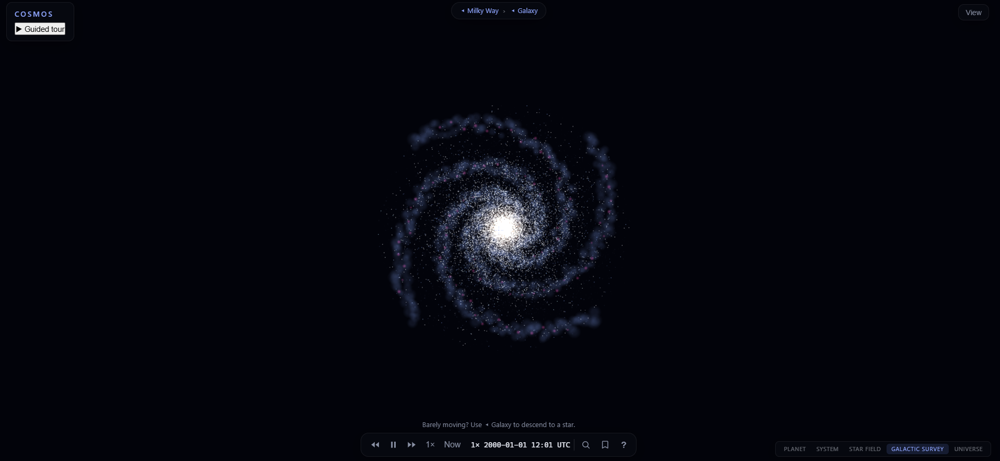

# cosmos — Universe Explorer

[](https://cosmos-coq.pages.dev/)

A browser-based, real-time 3D universe explorer: seamless zoom from intergalactic scale down
to planetary surfaces, rendering real star catalogs (HYG, Gaia subsets, NASA Exoplanet
Archive) blended with procedural content. React 19 + TypeScript + Three.js (R3F) + Web
Workers, in a pnpm/Turborepo monorepo of 17 library packages plus the app and 7 build tools.

**Live demo → [cosmos-coq.pages.dev](https://cosmos-coq.pages.dev/)**

The interface is its own package: [`packages/ui`](packages/ui/src) holds 15 React components —
search palette, scale ruler, time controls, info and bookmarks panels, guided-tour chrome,
first-run overlay — with their presentation logic extracted into pure modules
(`scale-ruler.ts`, `jump-hud-model.ts`, `astro-derive.ts`) so the components stay thin, and 18
test files covering both layers. It may not import Three.js; that boundary is enforced by
lint, not by convention (§3).

**The graphics are the hard problem; the engineering method is the point of the repo.** If
you are here from a CV, the four sections below are what to read — they are the parts that
transfer to any codebase.

## 1. Measure before fixing — root cause, not theory

Every non-trivial bug here got a measurement pass before a patch, and the pass is written
down whether or not it confirmed the first hypothesis. `docs/research/` holds 30 of these.
Three that read standalone, without any context on this project:

- [**Stars jitter when you fly close to one**](docs/research/star-approach-jitter.md) — the
  obvious suspect (the f64 floating-origin math) was measured and cleared. The real cause was
  a single-precision sum *on the GPU*, where both terms can reach ±32 pc and the f32 ULP is
  ~0.4–0.8 AU. The writeup keeps the ruled-out hypothesis; that's the useful half.
- [**A catalog silently disappeared on approach**](docs/research/bug-8-combine-drops-source.md)
  — combining two octree catalogs dropped the shallower one. The symptom *flipped* depending
  on which pack was loaded, which is what made it look non-deterministic. It also documents a
  prior "fixed in working tree" claim that was never actually committed.
- [**"Passes locally, fails in CI"**](docs/research/e2e-ci-flakiness-rootcause-and-query-hook.md)
  — I taxonomized the last ~16 e2e-touching commits instead of retrying the flaky specs. Most
  failures were test↔environment coupling, not product bugs. That diagnosis produced the fix
  in §3 below — which reduced CI-only flakes structurally rather than eliminating them; a few
  still surface.

## 2. Gate on deterministic proxies — screenshots and wall-clock never block

A 3D app tempts you to gate on frame rate and pixels. Both are properties of the machine, not
of the code, and a gate that fails for reasons the author cannot control gets disabled. So
this repo splits them:

- **Blocking in CI:** correctness invariants and *work-budget caps* — how many points were
  drawn, how many draw calls, how many chunks were resident. Machine-independent counts.
- **Reference-machine only:** visual baselines and wall-clock perf, guarded by
  `!process.env.CI` and `@perf` tags. They still run; they never block. One deliberate
  exception blocks: a catastrophic-hang check (no single boot frame over 1s,
  [`boot-perf.spec.ts`](e2e/tests/boot-perf.spec.ts)) — loose enough that no plausible
  machine trips it, so it catches a freeze without gating on speed.

Consequence, written down rather than glossed: CI cannot prove the app is *fast*. It proves
the app does not do more *work* than budgeted, and I check speed by hand on real hardware.
Rules in [`docs/testing-conventions.md`](docs/testing-conventions.md), enforcement in
[`.github/workflows/ci.yml`](.github/workflows/ci.yml).

**Scale:** the renderer is proven against a **~4.7M-star Gaia DR3 pack** through streamed
octree LOD, plus a 1M-point procedural Milky Way under a per-tier draw budget. Multi-GB star
packs belong in object storage, not in git, so the pack is selected at build time via
`VITE_GAIA_OCTREE_MANIFEST_URL` ([`packs.ts`](apps/web/src/app/packs.ts)) — an R2/CDN URL for a
dense pack, or the committed 135-star sample, which is the default. CI and the live demo
therefore both run on the versioned 109k-star HYG pack: the budgets CI enforces are sized to
what the pipeline can reproduce, and the dense pack is a delivery concern, not a test input.

## 3. Tests that can fail — anti-tests and real-state queries

Three rules do most of the work here.

**A gate ships with a deliberately naive implementation that must FAIL it.** The Phase 0
acceptance gate ([`packages/coords/test/jitter.test.ts`](packages/coords/test/jitter.test.ts))
orbits a camera 1 AU around a marker 8 kpc out for 300 frames and asserts sub-pixel screen
stability (< 0.5 px). Alongside it, the same orbit runs the banned implementation — absolute
positions rounded to f32 *before* the camera subtraction — and a third test asserts that path
**fails the same threshold**. A gate that a broken implementation also passes is decoration.
If the control ever goes green, the instruction in the file is: fix the test, never relax the
threshold.

**Query the app's real state; never re-derive production math in a test.** The E2E suite used
to reimplement the camera projection to decide where a star should be on screen — two models
that drifted apart, which is where much of the CI-only flakiness came from. That model is
gone. [`apps/web/src/glue/test-hook.ts`](apps/web/src/glue/test-hook.ts) exposes a thin read
hook (`window.__cosmos`) with `pickAt(x, y)` and `projectToScreen(pos)` delegating to the
*same closures* production uses for real clicks. A spec asks the app what a pixel selects
instead of computing an answer of its own.

**Architecture frozen by lint, with messages that teach.**
[`eslint.config.js`](eslint.config.js) encodes the dependency boundaries as per-package
import bans, and each one explains itself rather than just failing:
`'Math.random() breaks determinism. Use createPrng from @cosmos/core-types.'` ·
`'nav must not import Three.js (§5.3).'` · `'Deep imports banned: use the package public API
(index.ts).'` The immediate reviewer is often an agent, and an error message is the only
documentation it is guaranteed to read — but the problem is the ordinary design-system one:
consumers reach past your public API, and a boundary that lives in a doc instead of in the
toolchain is a boundary that erodes. Here the public surface of each package is `index.ts`,
deep imports fail the build, and the error tells you what to use instead.

## 4. The repo is a work environment for agents

Much of the code was written by AI coding agents working one package at a time. What they
worked against is mine: the task specs, the package boundaries, the gates and their controls,
and the root-cause passes in §1 — agents implement inside guardrails, and §3 is why a bad
implementation does not survive review. The generalized method — task specs as
contracts, gates that a naive implementation fails, judgment-call logging — is published
separately as [**executable-specs**](https://github.com/MattRosset/executable-specs) (see its
[`doctrine/BUILD-FOR-AGENTS.md`](https://github.com/MattRosset/executable-specs/blob/main/doctrine/BUILD-FOR-AGENTS.md)).
This repo is where it was derived and is the standing test of it.

---

## Status — and how package APIs are versioned

**Phase 4a complete (gate TASK-053) — Phase 4b (chunked planet terrain, ADR-007) is the next
planning pass.** The full technical design lives in
[`docs/architecture.md`](docs/architecture.md). Execution is tracked task-by-task in
[`docs/agent-tasks/README.md`](docs/agent-tasks/README.md) — **agents: start there.**

Each package carries a versioned public API, and between milestones those surfaces are
**frozen**: a change to one is a deliberate, announced thaw rather than an incidental edit
made while working on something else. The block below is the current freeze — the same
mechanism a design system uses to keep consumers from paying for churn they did not ask for.

> **GATE (Phase 4a / M4a frozen):** as of TASK-053, the public APIs of `render-fx`, `render-planets`
> (v2 atmosphere), `data` (v4 constellations), `app-state`/`ui` (v3), `nav` (v5), `streaming` (v1.1),
> and the Gaia/octree pack surface are **frozen**. The **Phase 4b (terrain) thaw** is the next
> sanctioned change window.

## Key Documents

| Document | Purpose |
|---|---|
| [`docs/architecture.md`](docs/architecture.md) | Complete technical design: stack, system decomposition, roadmap, budgets, standards |
| [`docs/testing-conventions.md`](docs/testing-conventions.md) | How tests are written and what is allowed to block CI |
| `docs/decisions/` | Architecture Decision Records (ADRs) |
| `docs/research/` | Root-cause writeups and investigations (30) |
| [`docs/agent-tasks/README.md`](docs/agent-tasks/README.md) | **Task index, status table, and execution rules for AI coding agents** |

## Running it

```bash
pnpm install
pnpm dev            # app at localhost:5173
pnpm verify         # lint + typecheck + unit tests + build (no e2e, by design)
pnpm test:e2e       # build web + deterministic e2e gate on chromium
```

## Stack (summary)

- **Language:** TypeScript (strict)
- **Framework:** React 19 + Vite
- **3D:** Three.js via React Three Fiber + drei (WebGL2 baseline)
- **State:** Zustand
- **Compute:** Web Workers + Comlink
- **Monorepo:** pnpm workspaces + Turborepo
- **Testing:** Vitest + Playwright (E2E, visual regression, perf)
- **Hosting:** static bundle on Cloudflare Pages ([live](https://cosmos-coq.pages.dev/)); no backend

## Core Architectural Rules

The constraints every package is written against; §3 above is how they are enforced rather
than merely documented. Full rationale in [`docs/architecture.md`](docs/architecture.md).

1. **Scale contexts, not one giant world** — hierarchical coordinate frames with a floating origin (architecture §5.2; the critical path, and what the jitter gate protects).
2. **Render thread is sacred** — heavy work runs in workers, transferable buffers only.
3. **React owns structure, never per-frame data.**
4. **Determinism everywhere** — seeded PRNG, pure generators, reproducible data packs.
