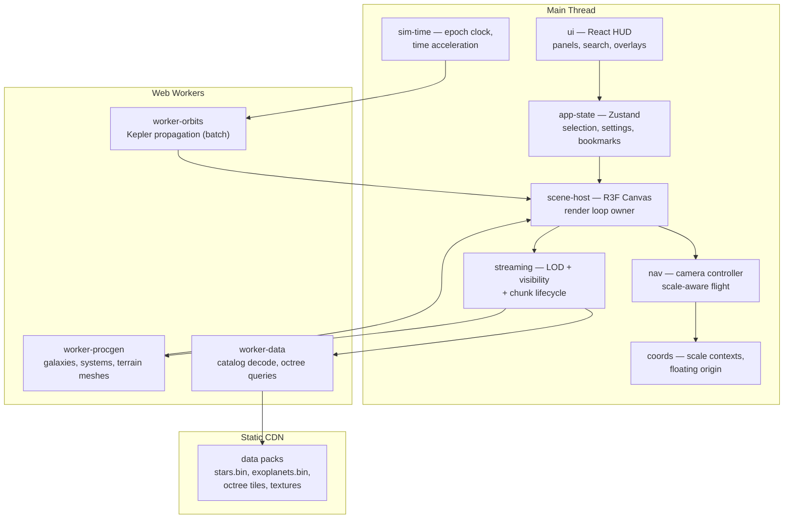

# Universe Explorer — Technical Design Document

**Project codename:** `cosmos`
**Document type:** Architecture & Implementation Plan
**Target:** Small team (1–3 humans) + AI coding agents, web-first, 6–9 month horizon

---

## 1. Executive Summary

A browser-based, real-time 3D universe explorer: seamless zoom from intergalactic scale down to planetary surfaces, rendering real star catalogs (HYG/Gaia subsets, NASA Exoplanet Archive) blended with procedural content, with smooth camera navigation, time acceleration, and educational overlays.

**The single most important architectural decision in this project is not rendering — it is scale handling.** The universe spans ~26 orders of magnitude. Naive use of 32-bit floats in world space will destroy the project in week 3. Everything else (LOD, streaming, procedural generation) hangs off the coordinate architecture defined in §5.2. Get that right first.

**Guiding principles:**

1. **Scale contexts, not one giant world.** The universe is a hierarchy of local coordinate frames, never one global float space.
2. **Render thread is sacred.** All generation, parsing, and math heavier than O(visible objects) runs in Web Workers.
3. **Every subsystem is a package with a typed public API.** AI agents work on one package at a time against frozen interfaces.
4. **Data-driven over hardcoded.** Celestial bodies are records conforming to schemas, not bespoke classes.
5. **Cut multiplayer.** (Evaluated in §14 — it triples backend scope for marginal experience value. Design the state layer so it *could* be added, then don't add it.)

---

## 2. Recommended Stack & Tradeoff Analysis

### 2.1 Final stack

| Layer | Choice | Version policy |
|---|---|---|
| Language | TypeScript (strict) | latest stable |
| Framework | React 19 + Vite | latest stable |
| 3D | Three.js via React Three Fiber (R3F) + drei | pin minor versions together |
| Graphics API | WebGL2 baseline; WebGPU as progressive enhancement in Phase 5 only | — |
| State | Zustand (UI/app state) + plain ES modules with events (simulation state) | — |
| Workers | Native Web Workers + Comlink for RPC ergonomics | — |
| Data formats | Binary typed-array packs (`.bin` + JSON manifest) for catalogs; KTX2/Basis for textures | — |
| Monorepo | pnpm workspaces + Turborepo | — |
| Testing | Vitest (unit), Playwright (E2E + visual regression) | — |
| Hosting | Static hosting + CDN (Cloudflare Pages or Vercel) — **no backend server in MVP** | — |
| CI | GitHub Actions | — |

### 2.2 Key tradeoffs

**R3F vs. raw Three.js.** R3F wins for this team profile: declarative scene graphs are vastly easier for AI agents to generate correctly, drei provides camera controls/instancing/loaders for free, and React already owns the HUD. Cost: ~5–10% overhead per-frame from reconciliation if misused. Mitigation: hot paths (star fields, orbit propagation, planet chunks) bypass React entirely — they mutate Three objects inside `useFrame` or live in imperative modules that R3F merely mounts. **Rule: React owns structure, never per-frame data.**

**WebGL2 vs. WebGPU.** WebGPU coverage in mid-2026 is good on desktop Chrome/Edge, partial on Safari/Firefox/mobile. Three.js's `WebGPURenderer` + TSL node materials are usable but still churn API-wise. Decision: build on WebGL2 with GLSL, structure materials so a WebGPU/TSL port is a Phase 5 swap, not a rewrite. Do not write compute shaders the project depends on.

**Three.js vs. Babylon vs. custom engine.** Babylon is heavier and its React story is weaker. A custom engine is the classic way this project dies. Three.js has the largest training-data footprint of any 3D library, which directly improves AI agent output quality — a real, measurable factor for this team.

**Real data vs. procedural.** Both, layered: real catalogs provide the ~10⁵ nearest/brightest stars and known exoplanets (credibility, education value); procedural generation fills everything beyond catalog reach (density, wonder). The data layer must make the two indistinguishable to the renderer (§5.7).

**Ecliptic/ICRS coordinates vs. game coordinates.** Use ICRS-derived galactic Cartesian coordinates (parsecs) as the canonical universe frame, converted once at data-pack build time — never at runtime.

---

## 3. Architecture Overview



**Data flow per frame (main thread):** input → `nav` updates camera in current scale context → `coords` rebases origin if needed → `streaming` updates visible set / requests chunks → `scene-host` renders. Worker results arrive as transferable `ArrayBuffer`s and are uploaded to GPU buffers between frames.

---

## 4. Repository & Folder Structure

pnpm monorepo. Each package = one agent-assignable unit with its own tests and README.

```
cosmos/
├── package.json                  # pnpm workspace root
├── turbo.json
├── .github/workflows/ci.yml
├── docs/
│   ├── architecture.md           # this document, kept current
│   ├── decisions/                # ADRs: ADR-001-coordinates.md, ...
│   └── agent-tasks/              # task specs for AI agents (§8)
├── apps/
│   └── web/                      # the only app. Vite + React entry
│       ├── src/
│       │   ├── main.tsx
│       │   ├── App.tsx           # composes Canvas + HUD
│       │   └── routes/           # if/when deep-linking added
│       └── public/
├── packages/
│   ├── core-types/               # shared types & schemas. ZERO deps.
│   │   └── src/
│   │       ├── bodies.ts         # StarRecord, PlanetRecord, GalaxyRecord
│   │       ├── coords.ts         # ScaleContext, UniversePosition
│   │       ├── orbits.ts         # KeplerElements
│   │       └── events.ts         # typed event map
│   ├── coords/                   # scale contexts, floating origin, transforms
│   ├── sim-time/                 # epoch clock, time acceleration
│   ├── orbits/                   # Kepler math (pure functions, no Three.js)
│   ├── procgen/                  # deterministic generators (pure, seedable)
│   ├── data/                     # catalog loading, decoding, spatial index
│   ├── streaming/                # LOD policy, chunk lifecycle, budgets
│   ├── render-stars/             # star field rendering (instanced/impostor)
│   ├── render-galaxy/            # galaxy particle rendering
│   ├── render-planets/           # planet spheres → chunked terrain (later)
│   ├── render-fx/                # skybox, bloom, atmosphere, nebulae
│   ├── nav/                      # camera controller + input mapping
│   ├── ui/                       # HUD components (React only, no Three.js)
│   ├── app-state/                # Zustand stores, persistence
│   └── workers/                  # worker entry points + Comlink contracts
├── tools/
│   ├── pack-stars/               # build script: HYG/Gaia CSV → stars.bin
│   ├── pack-exoplanets/          # NASA archive → exoplanets.bin
│   └── pack-octree/              # spatial tiling of catalogs
└── e2e/                          # Playwright suites + visual baselines
```

**Hard dependency rules (enforced by ESLint `import/no-restricted-paths` + Turborepo graph):**

- `core-types` imports nothing.
- `orbits`, `procgen`, `sim-time` import only `core-types` (pure, fully unit-testable, no DOM/Three).
- `render-*` packages import Three.js but never React.
- `ui` imports React but never Three.js.
- Only `apps/web` and `scene-host` glue may import across these groups.

This separation is what makes parallel agent work safe.

---

## 5. System Decomposition

Each subsystem below follows the required template: responsibilities, boundaries, inputs/outputs, dependencies, technologies, common mistakes, validation criteria.

---

### 5.1 `scene-host` — Render Loop & Scene Composition

- **Responsibilities:** Owns the R3F `<Canvas>`, renderer configuration (logarithmic depth buffer ON, color management, tone mapping), frame loop ordering, postprocessing chain, and mounting/unmounting of render packages based on active scale context.
- **Boundaries:** Does NOT contain rendering logic for any body type. It composes; packages render.
- **Inputs:** Active scale context (from `coords`), visible-set updates (from `streaming`), app settings (quality tier).
- **Outputs:** Rendered frames; per-frame `FrameContext { camera, dtMs, simEpoch }` passed to subscribers via R3F's `useFrame` priority system.
- **Dependencies:** R3F, all `render-*` packages, `coords`, `streaming`.
- **Technologies:** R3F `<Canvas gl={{ logarithmicDepthBuffer: true, antialias: false }}>`, `postprocessing` lib, drei `<PerformanceMonitor>` for adaptive quality.
- **Common mistakes:**
  - Forgetting the logarithmic depth buffer → z-fighting at astronomical scale. Enable from day one.
  - Letting React re-render the Canvas subtree on UI state changes — isolate Canvas from HUD state with separate stores/selectors.
  - Using MSAA + postprocessing together on WebGL2 (broken/expensive) — use FXAA/SMAA in the post chain.
- **Validation criteria:** Empty scene + star skybox renders at 120fps on mid-tier laptop; resizing window causes no leaks (heap snapshot stable over 50 resizes); toggling HUD panels causes zero `<Canvas>` re-renders (verify with React DevTools profiler).

---

### 5.2 `coords` — Scale Contexts & Floating Origin ⚠️ *critical path*

- **Responsibilities:** Define the universe position type and all transforms between scales. Implements **camera-relative rendering with a floating origin**: the render world origin is periodically rebased to the camera, and a hierarchy of *scale contexts* renormalizes units as you zoom.
- **Design (be explicit — agents must not improvise here):**
  - `UniversePosition = { context: ContextId, local: [f64, f64, f64] }` where `local` is stored as JS numbers (which are f64 — sufficient) and only converted to f32 *after* subtracting camera position.
  - Scale contexts: `universe` (unit = 1 Mpc), `galaxy` (unit = 1 pc), `system` (unit = 1 AU), `planet` (unit = 1 km). Each context defines its parent and the f64 transform to it.
  - **Rebase rule:** when `|cameraLocal| > 10,000` units in current context, subtract camera position from all root-level render groups and zero the camera. When camera approaches/leaves an anchor body, switch context (e.g., entering a star system reparents into `system` frame).
  - All `render-*` packages receive positions as *camera-relative f32* computed by this package — they never see absolute coordinates.
- **Inputs:** Camera state from `nav`; body positions from `data`/`orbits` in their native frames.
- **Outputs:** `toRenderSpace(pos: UniversePosition): Vector3`, rebase events, current context.
- **Dependencies:** `core-types` only. No Three.js in the math core (a thin adapter exposes `Vector3`).
- **Common mistakes:**
  - Storing absolute positions in f32 anywhere (including GPU buffers — star buffers must be context-local).
  - Rebasing mid-frame (do it at frame start, atomically).
  - Trying "one global double-precision world" with emulated f64 in shaders — unnecessary complexity; the context hierarchy avoids it.
  - Forgetting velocity/orientation also need rebasing.
- **Validation criteria:** Property-based unit tests: round-trip context conversions lose < 1e-6 relative error; jitter test — orbit a camera 1 AU from a planet positioned 8 kpc from galactic center, vertex positions must be stable to sub-pixel (automated via rendering a marker and asserting screen-space variance < 0.5px across 300 frames).

---

### 5.3 `nav` — Camera & Navigation

- **Responsibilities:** Scale-aware flight controls. Speed proportional to distance-to-nearest-body (logarithmic flight), smooth go-to-target transitions (double-click a star → animated approach), orbit mode around selected bodies, input mapping (mouse/keyboard/touch), and the **seamless zoom** behavior that defines the product.
- **Boundaries:** Mutates camera only. Never touches scene content. Selection comes *in* from `app-state`; nav doesn't do picking.
- **Inputs:** Pointer/keyboard/touch events; selected target; nearest-body distance query (provided by `streaming` as a per-frame scalar).
- **Outputs:** Camera position/orientation in current scale context; context-switch requests to `coords`.
- **Technologies:** Custom controller (do NOT use OrbitControls as the base — it can't do scale-adaptive flight; use drei's `CameraControls` only for the orbit-a-body sub-mode). Damped exponential easing; `speed = clamp(k * distanceToNearestSurface)`.
- **Common mistakes:**
  - Linear zoom speed (unusable across 10²⁶ range) — speed must scale with proximity.
  - Gimbal lock from Euler accumulation — quaternion-only orientation.
  - Go-to animations in absolute coordinates breaking across context switches — animate in *target's* frame.
  - No input deadzone/touch handling considered too late.
- **Validation criteria:** Scripted Playwright test: fly from intergalactic view to a planet surface in < 30 s of simulated input with no visible snapping (visual regression on keyframes); approach a star from 100 AU — speed decays so user never overshoots through the body.

---

### 5.4 `sim-time` — Simulation Clock

- **Responsibilities:** Maintains simulation epoch (Julian Date, f64), time-acceleration factor (1× to ±10⁷×), pause, and "now" sync. Emits epoch per frame.
- **Inputs:** UI time controls; wall-clock dt.
- **Outputs:** `epochJD: number` in `FrameContext`.
- **Dependencies:** `core-types`.
- **Common mistakes:** Accumulating epoch in seconds-as-f32 (precision loss within hours); coupling time stepping to frame rate without clamping dt (tab-switch returns cause orbit teleports — clamp dt to 100 ms).
- **Validation criteria:** Unit tests: 10⁶× acceleration for simulated century retains millisecond epoch precision; pause/resume is bit-exact.

---

### 5.5 `orbits` — Orbital Mechanics

- **Responsibilities:** Keplerian two-body propagation: orbital elements → position/velocity at epoch. Solve Kepler's equation (Newton-Raphson with safe fallback for high eccentricity). Generate orbit-line polylines. **Explicitly NOT n-body** — patched Keplerian ellipses are correct-enough and deterministic, which matters for streaming and AI testability.
- **Inputs:** `KeplerElements { a, e, i, Ω, ω, M0, epoch0, μ }` per body; target epoch.
- **Outputs:** Position in parent-body frame (f64 triple). Batch API: `propagateBatch(elements: Float64Array, epoch): Float64Array` — designed to run in `worker-orbits` for systems with many bodies, on main thread for ≤ 50 bodies.
- **Dependencies:** `core-types` only. Pure functions. No Three.js.
- **Common mistakes:** Degrees vs. radians (standardize on radians internally, convert at data-pack boundary); wrong anomaly (mean vs. eccentric vs. true) — name variables explicitly `meanAnomaly`, never `M`; singularities at e≈0 and i≈0 (use universal-variable or guard formulations).
- **Validation criteria:** Unit tests against published ephemeris values for the 8 planets at J2000 ± 50 yr, tolerance < 0.1% of orbital radius; Kepler solver converges for e ∈ [0, 0.99] in ≤ 12 iterations (property test).

---

### 5.6 `procgen` — Procedural Generation

- **Responsibilities:** Deterministic, seedable generation of: galaxy star distributions (density-wave spiral arms via rejection sampling), star properties (mass→temperature→color via simplified main-sequence relations), planetary systems (Titius-Bode-ish spacing + type assignment), and planet surface parameters (later: terrain heightfields). **Every output is a pure function of `(seed, params)`.**
- **Boundaries:** Produces *data records* (`StarRecord[]`, packed typed arrays) and *meshes as raw buffers* — never Three.js objects, never touches DOM. Runs identically on main thread (tests) and in workers (production).
- **Inputs:** Seed (derived hierarchically: `hash(galaxySeed, sectorId, starIndex)`), generation params, LOD level.
- **Outputs:** Transferable `ArrayBuffer`s with a JSON manifest describing layout (`{ positions: {offset, count}, colors: {...} }`).
- **Technologies:** `xxhash`-style seeded PRNG (implement once in `core-types`, ~30 lines, no dependency); simplex noise (vendored, typed).
- **Common mistakes:**
  - `Math.random()` anywhere (lint-ban it in this package) — breaks determinism and tests.
  - Generating per-star objects (GC death) — generate straight into typed arrays.
  - Coupling generation to camera (generation takes region + LOD, never camera).
  - Seed collisions from naive `seed + index` — use proper hash mixing.
- **Validation criteria:** Same seed → byte-identical output (snapshot tests on buffer hashes); galaxy generation of 10⁶ stars completes < 500 ms in worker; statistical tests (star color distribution matches configured IMF within tolerance).

---

### 5.7 `data` — Catalog & Asset Data Layer

- **Responsibilities:** Load, decode, and index real astronomical data packs; expose a **uniform body API** so renderers can't tell real from procedural: `queryRegion(box, maxCount): BodyBatch`, `getBody(id): BodyRecord`, `search(name): BodyRecord[]`.
- **Data sources & pipeline (build-time, in `tools/`):**
  - **HYG v4** (~120k stars, public domain CSV) → MVP star catalog. Convert RA/Dec/parallax → galactic Cartesian parsecs, pack as `Float32Array` (position, color index, absolute magnitude) ≈ 2.4 MB binary.
  - **NASA Exoplanet Archive** (TAP/CSV, ~6k systems) → exoplanet pack with Kepler elements where available.
  - **Gaia DR3 subset** (Phase 4): brightest ~2–5M stars, spatially tiled into an octree of `.bin` tiles (≤ 512 KB each) served statically; loaded on demand by `streaming`.
  - Solar system: hand-authored JSON with elements from JPL approximate ephemerides (a known published table — agents can transcribe it verbatim).
- **Inputs:** HTTP range/file fetches of static packs; region queries from `streaming`.
- **Outputs:** Typed-array batches + records conforming to `core-types` schemas (validated with Zod at pack-build time, *not* runtime).
- **Dependencies:** `core-types`; decode runs in `worker-data`.
- **Common mistakes:**
  - Parsing CSV in the browser (do all conversion at build time; the browser only ever sees binary packs + small JSON manifests).
  - Mixing units (mandate: parsecs for interstellar, AU intra-system, km for planet-local — encode units in type names: `distancePc`, `semiMajorAxisAu`).
  - Loading entire Gaia subset eagerly — must be tiled.
  - Ignoring missing-data flags in real catalogs (exoplanets often lack inclination — define documented fallbacks).
- **Validation criteria:** Pack builder is reproducible (same input → same hash); Sirius, Vega, Alpha Cen appear within 1% of known positions/colors in a rendered validation scene; `queryRegion` on a 50k-star tile returns in < 5 ms.

---

### 5.8 `streaming` — LOD & Spatial Streaming

- **Responsibilities:** The policy brain. Decides per frame: which octree tiles to fetch, which procedural chunks to request from workers, which to evict, and the LOD level of every visible aggregate. Owns memory/draw-call **budgets** (e.g., ≤ 350 MB GPU, ≤ 300 draw calls, ≤ 2M rendered star points) and degrades gracefully when exceeded. Maintains the nearest-body distance scalar for `nav`.
- **Boundaries:** Does not render and does not generate — it orchestrates requests and hands ready buffers to `render-*` mounts via a typed registry.
- **Inputs:** Camera + context (from `coords`), tile manifests (from `data`), budget config, `PerformanceMonitor` quality tier.
- **Outputs:** `ChunkLifecycleEvent`s: `request | ready | evict`, each carrying chunk id, LOD, buffer handles.
- **Technologies:** Linear octree keyed by Morton codes per scale context; LRU eviction; request prioritization by screen-space error (projected size / distance).
- **Common mistakes:**
  - LOD popping with no hysteresis — require crossing thresholds by 15% before switching, and cross-fade star tiles over ~0.3 s.
  - Unbounded in-flight requests (cap at 4–8; cancel stale ones on fast camera movement via AbortController + worker-side cancellation tokens).
  - Evicting the chunk the camera is inside.
  - Computing visibility on worker (1-frame-stale camera causes misses) — visibility on main thread, generation on worker.
- **Validation criteria:** Flythrough script (recorded camera path through galaxy → system → planet) maintains ≥ 55 fps on the reference machine with zero frame > 50 ms; memory plateaus (no monotonic growth over 10-min soak); chunk request count during fast flight stays under cap (assert via instrumentation counters in E2E).

---

### 5.9 `render-stars` / `render-galaxy` — Point-Mass Rendering

- **Responsibilities:** GPU rendering of star fields and galaxy particle clouds from typed-array batches: custom `ShaderMaterial` point sprites with magnitude-based sizing, temperature→color (blackbody LUT baked into a 1D texture), soft circular falloff, additive blending for distant aggregates. Galaxy = same machinery + dust-lane billboards + a baked impostor sprite for ultra-far LOD.
- **Inputs:** `BodyBatch` buffers (camera-relative positions per §5.2), exposure/quality settings.
- **Outputs:** Three.js `Points`/`InstancedMesh` objects mounted into scene-host slots.
- **Dependencies:** Three.js, `core-types`. **No data fetching, no React.**
- **Common mistakes:**
  - One draw call per star (must be one draw per tile/batch).
  - Point size in world units only (clamp screen-space size to [1px, ~64px] in vertex shader or near stars become screen-filling squares).
  - Updating buffers by recreating geometry (use `BufferAttribute.set` + `needsUpdate`, preallocate to tile max).
  - sRGB/linear confusion making stars look washed out — define color pipeline once in scene-host and document it.
- **Validation criteria:** 2M points at 60 fps on reference GPU; visual regression snapshots of Orion region match baseline (SSIM > 0.98); buffer swap on tile load causes no frame > 20 ms.

---

### 5.10 `render-planets` — Bodies & Surfaces

- **Responsibilities:** Phase-dependent. **Phase 2:** spheres with PBR-ish custom shader: albedo/normal textures for solar-system bodies (NASA public-domain maps), procedural gradient + noise for exoplanets, day/night terminator from star direction, rings (Saturn) as alpha-textured annulus. **Phase 4:** quadtree-sphere chunked LOD terrain (CDLOD) with heightfields generated in `worker-procgen`. **Phase 4:** atmospheric scattering as a single analytic-approximation shader (e.g., O'Neil-style) on an inverted shell — explicitly *not* full Bruneton precomputed scattering.
- **Inputs:** `PlanetRecord`, star direction, camera distance (selects sphere-vs-chunked mode), terrain chunk buffers from workers.
- **Outputs:** Mounted meshes; LOD-mode-change events.
- **Common mistakes:**
  - Starting with chunked terrain (the #1 scope trap — textured spheres are 90% of perceived value at 5% of cost; chunked terrain only matters below ~2× planet radius).
  - Texture pole pinching with naive UV spheres — use cube-sphere mapping when terrain arrives; tolerate UV spheres for Phase 2.
  - Cracks between terrain chunks of different LOD (skirts are the cheap, correct answer; do not attempt stitching).
  - Atmosphere shader perf: full per-pixel ray-marched scattering on mobile — gate behind quality tier.
- **Validation criteria:** Earth render side-by-side with reference imagery passes review; approach from 10⁶ km → 10 km shows ≤ 1 visible LOD pop; terrain chunk gen < 8 ms per chunk in worker; no cracks in automated screenshot sweep of 20 camera angles.

---

### 5.11 `render-fx` — Effects

- **Responsibilities:** Skybox (procedural deep-field cube texture, baked offline), bloom (selective, threshold on emissive), nebulae (Phase 4: camera-facing layered noise billboards — *not* volumetric ray-marching as baseline), black hole (Phase 5: screen-space gravitational-lensing shader sampling the skybox + accretion disk billboard — visually stunning, well-trodden shader territory, surprisingly cheap).
- **Common mistakes:** Full-res bloom (half or quarter res); nebula overdraw tanking fill-rate (cap layer count, dither); attempting real volumetrics first.
- **Validation criteria:** Effects toggleable individually; quality tiers verified on a throttled-GPU Playwright run; bloom adds < 2.5 ms at 1440p on reference GPU.

---

### 5.12 `ui` + `app-state` — HUD & Application State

- **Responsibilities:** `ui`: search palette (fuzzy search over catalog names), selected-body info panel (educational data: distance, spectral class, discovery info), time controls, navigation breadcrumb (Universe → Milky Way → Sol → Earth), settings, bookmarks panel, onboarding hints, optional cinematic-mode chrome-hide. `app-state`: Zustand stores — `selectionStore`, `settingsStore`, `bookmarkStore` (persisted to `localStorage`/IndexedDB), `tourStore`. Bookmarks serialize `{ universePosition, contextId, cameraOrientation, simEpoch }` — versioned schema with migration function from day one.
- **Boundaries:** `ui` never imports Three.js. Interaction with 3D goes exclusively through store actions and a typed event bus (`core-types/events.ts`). Picking (click a star) is implemented in scene-host (GPU pick or raycast against tile bounding volumes → per-point) and *dispatches* to the store.
- **Common mistakes:** Subscribing HUD components to per-frame data (camera position readout must be throttled to ~10 Hz via a transient store outside React state); blocking the canvas with full-screen DOM overlays that eat pointer events (`pointer-events: none` on the overlay root, opt-in per panel).
- **Validation criteria:** Search returns Sirius in < 50 ms from 120k records; HUD interactions cause zero dropped frames (Playwright trace assertion); bookmark round-trip restores camera within ε after page reload; full keyboard navigation of panels (a11y smoke test).

---

### 5.13 `workers` — Worker Infrastructure

- **Responsibilities:** Worker pool (size = `min(navigator.hardwareConcurrency - 1, 4)`), Comlink-wrapped typed contracts, cancellation tokens, transferable-buffer discipline, structured error propagation.
- **Common mistakes:** Cloning instead of transferring buffers (assert `byteLength === 0` post-transfer in dev); spawning workers per task (pool them); importing Three.js into workers (banned — workers produce raw buffers); forgetting Vite worker bundling syntax (`new Worker(new URL('./x.ts', import.meta.url), { type: 'module' })`).
- **Validation criteria:** Round-trip latency for a no-op task < 2 ms; cancelled tasks free worker within 50 ms; main thread long-task count during heavy generation = 0 (Performance API assertion in E2E).

---

## 6. Phased Roadmap

Complexity scale: S < 3 agent-days, M ≈ 1 agent-week, L ≈ 2–3 agent-weeks (one "agent-day" = one human reviewing AI-generated work on a well-specified task).

### Phase 0 — Foundation (Weeks 1–2) — *sequential, do not parallelize*

| Deliverable | Size |
|---|---|
| Monorepo scaffold, CI, lint rules, dependency-boundary enforcement | S |
| `core-types` v1: all schemas, event map, seeded PRNG | M |
| `coords` with full test suite (THE critical package) | L |
| `scene-host` minimal: Canvas, log-depth, frame loop, skybox | S |
| `nav` v1: free-flight with log-scaled speed | M |

**Acceptance criteria:** Jitter test from §5.2 passes. Fly camera over 12 orders of magnitude with stable rendering of debug markers. CI green with coverage gate on `coords`/`orbits` paths ≥ 90%.

### Phase 1 — MVP "Stars" (Weeks 3–6)

| Deliverable | Size |
|---|---|
| `tools/pack-stars` + HYG pack | M |
| `data` v1: load pack, queryRegion, name search | M |
| `render-stars`: shader point sprites, color/magnitude | M |
| Picking + selection + info panel + search palette | M |
| Go-to-target camera animation | M |
| Deploy pipeline to CDN | S |

**Milestone M1 (demoable):** Browse the real night sky in 3D — fly among 120k real stars, click Sirius, read its data, search and fly to Betelgeuse. 60 fps desktop.
**Acceptance:** All §5.7/§5.9/§5.12 validation criteria for included features; Lighthouse perf ≥ 85; cold load < 4 s on cable connection.

### Phase 2 — Solar & Planetary Systems (Weeks 7–11)

| Deliverable | Size |
|---|---|
| `sim-time` + time controls UI | S |
| `orbits` + ephemeris test suite | M |
| Solar system data pack (planets, major moons, textures as KTX2) | M |
| `render-planets` v1: textured spheres, terminator, rings, orbit lines | L |
| `system` scale context + context-switch in `nav`/`coords` | M |
| Exoplanet pack + procedural system synthesis for incomplete data | M |
| Bookmarks + exploration history | S |

**Milestone M2:** Zoom from star field into Sol, watch planets orbit at 10⁶× time, visit Saturn, then jump to TRAPPIST-1 and tour its (semi-procedural) planets.
**Acceptance:** Context switches invisible to user (visual regression on transition keyframes); orbit accuracy tests pass; time controls behave per §5.4.

### Phase 3 — Galaxy & Streaming (Weeks 12–16)

| Deliverable | Size |
|---|---|
| `procgen` galaxy generator (worker) | L |
| `streaming` octree + budgets + eviction | L |
| `render-galaxy`: particle clouds, dust, far-LOD impostor | M |
| `universe` context: local group of procedural galaxies | M |
| Adaptive quality tiers (PerformanceMonitor-driven) | S |

**Milestone M3 — the signature demo:** Continuous zoom from outside the Milky Way → spiral arms → star field → Sol → Earth, no loading screens.
**Acceptance:** Recorded-flythrough perf test from §5.8 passes; soak test memory-stable; works on Safari and Firefox (manual matrix + Playwright WebKit).

### Phase 4 — Depth & Beauty (Weeks 17–24)

| Deliverable | Size |
|---|---|
| Gaia DR3 tiled subset (2–5M stars) | L |
| Chunked planet terrain (CDLOD, worker meshing) | L |
| Atmospheric scattering shader | M |
| Nebulae (billboard volumetric-look) | M |
| Educational overlay system (constellation lines, labels, guided tours) | M |
| Cinematic camera mode (spline paths, letterbox, auto-orbit) | S |

**Milestone M4:** "Wow" build — atmospheric Earth flyover, descend toward procedural exoplanet terrain, guided tour mode for education use.

### Phase 5 — Stretch (evaluate, don't promise)

Black hole lensing (M, high impact-to-cost — recommended), WebGPU renderer swap (L, do only if WebGL2 perf ceiling is actually hit), shared "ghost explorer" presence via WebRTC/Liveblocks (L, **recommend cutting** — see §14), audio design (S), photo mode (S).

---

## 7. Recommended Development Order (dependency-driven)

```
core-types → coords → scene-host ─┬→ nav ──────────┬→ picking/selection
                                  └→ render-stars ←┴─ data ← pack tools
sim-time → orbits → render-planets (spheres) → context switching
procgen ⇄ workers → streaming → render-galaxy
(then Phase 4 items, each independent)
```

Rules: never build a renderer before its data contract exists in `core-types`; never build `streaming` before at least two chunk producers (tiles + procgen) exist to validate the abstraction; freeze `coords` API before Phase 1 parallelization begins.

---

## 8. AI-Agent Task Decomposition Strategy

This architecture is shaped for agent execution. Operating model:

**1. Task spec format.** Every agent task is a markdown file in `docs/agent-tasks/` containing: target package, frozen interface (exact TypeScript signatures it must implement/consume), inputs/outputs with example data, acceptance tests (often pre-written by the architect or a stronger agent), forbidden actions ("do not modify `core-types`", "do not add dependencies"), and the relevant "common mistakes" list from §5. Lower-cost agents execute; a senior human or stronger agent reviews.

**2. Interface-first workflow.** The architect (human + strong agent) writes `core-types` and per-package public APIs *before* implementation tasks are issued. Implementation agents may not change public APIs; API changes are separate, explicitly-reviewed tasks.

**3. Parallelization map.** Safe concurrent lanes after Phase 0: (a) `render-stars`, (b) `data` + pack tools, (c) `ui` panels against mocked stores, (d) `orbits` pure math, (e) `procgen` pure generators. Each lane touches disjoint packages — merge conflicts are structurally impossible. `streaming` and context-switching are integration-heavy: assign to the strongest agent/human pair, never parallelized.

**4. Tests as contracts.** Pure packages (`orbits`, `procgen`, `coords`) get test suites written *before* implementation — agents iterate until green. Render packages get visual-regression baselines reviewed by humans once, then enforced automatically.

**5. Sized for context windows.** No package over ~3k LOC; if it grows, split (e.g., `render-planets` → `planet-materials` + `planet-terrain`). Each package README states purpose, API, invariants in < 150 lines — that README plus `core-types` is sufficient context for any task in the package.

**6. Determinism doctrine.** Seeded PRNG everywhere, pure functions, no wall-clock reads outside `sim-time` — so agents can write meaningful assertions, and bug reports are reproducible by pasting a seed.

---

## 9. Performance Considerations (budgets & doctrine)

**Frame budget @60fps (16.6 ms), reference machine = 2021 mid-tier laptop, integrated+ GPU:**

- Render (draw + GPU): ≤ 10 ms · Main-thread JS: ≤ 4 ms · React/HUD: ≤ 1 ms · Headroom: ~1.6 ms
- Draw calls ≤ 300; rendered points ≤ 2M; GPU memory ≤ 350 MB; zero per-frame allocations in `useFrame` paths (scratch vectors pattern, lint rule banning `new THREE.Vector3()` inside frame callbacks).

**Doctrine:** instancing/batching for everything countable; frustum + octree culling before draw; texture compression (KTX2/Basis) mandatory for planet maps; `PerformanceMonitor` drops quality tier (point count → bloom → atmosphere → resolution scale) before dropping frames; workers for anything > 2 ms; `requestIdleCallback` for non-urgent uploads; measure with a built-in dev HUD (frame time graph, draw calls, memory) from Phase 0 — added cost S, saves weeks.

**Mobile:** treat as Tier-Low desktop (halved budgets) — supported but not design-driving until Phase 4.

---

## 10. Rendering Architecture Summary

Single R3F canvas, single scene graph with per-context root groups (`<group name="ctx:galaxy">`), camera-relative positioning (§5.2), logarithmic depth buffer + manual near/far per context. Layered composition per frame: skybox (depth-ignore) → far aggregates (galaxy impostors, additive) → star tiles (points) → system bodies (opaque PBR) → atmosphere shells (back-to-front transparent) → orbit lines/overlays → post chain (bloom → tone map ACES → FXAA). Materials are custom GLSL `ShaderMaterial`s with a shared chunk library (`render-fx/shaders/common/`) — uniform naming convention `uCameraExposure`, `uEpochJD`, etc., documented so agents reuse rather than reinvent. WebGPU path, if ever: same packages, materials ported to TSL, behind a renderer factory in scene-host — no other package may reference the renderer type.

---

## 11. Data Management Strategy

- **Build-time pipeline** (`tools/`): raw catalogs (CSV/VOTable) → validated (Zod) → unit-converted → packed binary + manifest → content-hashed filenames → uploaded to CDN. Reproducible, versioned (`packFormatVersion` in manifest, loader rejects mismatches).
- **Runtime:** small manifests fetched eagerly; binary tiles fetched on demand by `streaming`; decoded in `worker-data`; cached in memory (LRU) + Cache API for offline-ish repeat visits.
- **Licensing:** HYG (public domain), Gaia (free with attribution — render credit in About panel), NASA imagery (public domain), Exoplanet Archive (free, cite). Keep an `ATTRIBUTIONS.md`.
- **Persistence:** user data (bookmarks, history, settings) in IndexedDB via a thin versioned wrapper; export/import as JSON. No accounts, no backend, no PII in MVP→Phase 4.

---

## 12. Deployment & CI/CD

- **Hosting:** Cloudflare Pages (or Vercel) — static app + data packs on the same CDN, immutable cache headers on hashed assets, `index.html` no-cache.
- **Environments:** preview deploy per PR (automatic), `staging` on main, `production` on tagged release. Data packs deploy independently of app code (separate artifact path + manifest pointer), so catalog updates don't require app releases.
- **CI pipeline (GitHub Actions, Turborepo-cached):** `lint → typecheck → unit (Vitest) → build → E2E smoke (Playwright, chromium+webkit) → visual regression → bundle-size check (fail if apps/web JS > 1.2 MB gz) → perf smoke (recorded flythrough on a pinned runner, assert p95 frame time)`. Visual baselines stored in repo via Git LFS; update requires explicit `update-baselines` label.
- **Release:** changesets for versioning packages; tag → production deploy + Sentry release + source maps upload.
- **Monitoring:** Sentry (errors + WebGL context-loss events), simple web-vitals beacon. Context-loss handling (restore or graceful reload prompt) is a Phase 1 requirement, not an afterthought.

---

## 13. Testing & Validation Strategy

| Layer | Tool | What |
|---|---|---|
| Unit (pure) | Vitest | `coords`, `orbits`, `procgen`, `sim-time`, pack tools — high coverage, property-based where math-heavy (fast-check) |
| Unit (render) | Vitest + headless GL where feasible | shader compile checks, buffer layout assertions |
| Integration | Vitest + jsdom/mocks | store ↔ event bus ↔ scene-host wiring |
| E2E | Playwright | search→fly→select flows, bookmarks persistence, context-switch flythrough |
| Visual regression | Playwright screenshots + SSIM | star field baselines, planet renders, transition keyframes |
| Performance | Playwright + CDP tracing | recorded flythroughs, frame-time p95, long-task count, memory soak |
| Data validation | pack-build step | schema, unit ranges, known-star spot checks |

**Golden rule for agent-built features:** a task is not done until its acceptance tests (listed in the task spec) pass in CI. Human review focuses on the *spec and the visuals*, not line-by-line code.

---

## 14. Risk Analysis

| Risk | Likelihood | Impact | Mitigation |
|---|---|---|---|
| Coordinate/precision architecture wrong, discovered late | Med | **Fatal** | Phase 0 dedicates a full week + jitter test gate before anything else builds on it |
| Scope creep into terrain/volumetrics/multiplayer | High | High | Phase gates with demos; "spheres before terrain, billboards before volumetrics, single-player forever-until-proven-needed" |
| Multiplayer | — | — | **Cut.** Requires servers, presence protocol, state sync across 26 orders of magnitude. If revisited: ghost-cursor presence only, via managed service (Liveblocks), Phase 5+ |
| LOD popping / streaming jank ruins the seamless-zoom promise | Med | High | Hysteresis + cross-fades specified up front; perf tests in CI on recorded paths |
| Safari/WebKit divergence (texture limits, GC pauses) | Med | Med | WebKit in CI from Phase 1; quality tiers; avoid >4k textures |
| AI agents drifting from interfaces | Med | Med | Frozen `core-types`, lint-enforced boundaries, tests-as-contracts, small packages |
| Gaia data size blowing budgets | Med | Med | It's Phase 4, strictly tiled, capped at 5M brightest; HYG alone is a shippable product |
| Three.js/R3F breaking changes mid-project | Low | Med | Pin versions; upgrade only at phase boundaries as a dedicated task |

---

## 15. Coding Standards & Naming Conventions

- **TypeScript:** `strict: true`, `noUncheckedIndexedAccess: true`; no `any` (lint error); public APIs fully typed with TSDoc; Zod schemas only at data boundaries (build tools, persistence), not hot paths.
- **Naming:** packages `kebab-case`; types `PascalCase` records end in `Record` (data) vs `State` (mutable); units in names (`distancePc`, `radiusKm`, `epochJD`); events `domain/action` (`"nav/contextChanged"`); shaders `*.vert.glsl` / `*.frag.glsl`, uniforms `u*`, attributes `a*`, varyings `v*`; seeds named for derivation (`sectorSeed`, not `seed2`).
- **Files:** one exported concept per file; `index.ts` re-exports the public API only — deep imports across packages are lint-banned.
- **Frame-loop rules (lint-enforced where possible):** no allocation, no async, no store writes that trigger React, scratch objects module-scoped.
- **Comments:** explain invariants and physics, never mechanics. Every formula cites its source (e.g., "Kepler solver: Meeus, Astronomical Algorithms, ch. 30").
- **Commits/PRs:** conventional commits scoped by package (`feat(render-stars): ...`); one package per PR whenever possible; PR description links its agent task spec.

---

## 16. Developer Workflow Summary

Daily loop: pick task spec from `docs/agent-tasks/` → branch `feat/<package>-<slug>` → agent implements against frozen API + pre-written tests → local `pnpm turbo test lint typecheck` → PR → preview deploy → human reviews visuals + spec compliance → merge. Weekly: integration day (the human-led lane assembles parallel outputs), perf review against budgets, demo recording. Phase boundaries: milestone demo, retro, API thaw window (the only time `core-types` may change), re-pin dependencies.

---

## Bottom Line

MVP (M1, real-star exploration) is ~6 weeks of well-specified, largely parallelizable agent work. The signature seamless-zoom demo (M3) lands around week 16. The two things that demand senior attention are the **coordinate/scale architecture** and the **streaming integration** — everything else decomposes into isolated, deterministic, test-gated packages that low-cost agents can execute reliably.
